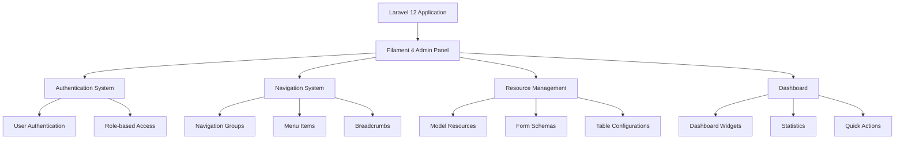

# Design Document: Filament Admin Backend Setup

## Overview

This design outlines the implementation of a fully functional Filament 4 admin backend system for the Laravel 12 application. The solution addresses current compatibility issues, establishes proper navigation structure, and ensures all admin resources function correctly. The design leverages Filament 4's latest features including navigation groups, resource organization, and modern form/table components.

## Architecture

### System Components



### Panel Configuration

The admin panel will be configured as the primary Filament panel with:
- Custom branding and styling
- Organized navigation structure
- Role-based access control
- Responsive design for mobile/desktop

### Navigation Architecture

Navigation will be organized into logical groups:
- **User Management**: Users, Roles, Permissions
- **Content Management**: News, Pages, Categories, Media
- **E-commerce**: Products, Orders, Inventory, Customers
- **System**: Settings, Logs, Reports, Configuration

## Components and Interfaces

### 1. Panel Provider Configuration

**Location**: `app/Filament/AdminPanelProvider.php`

The panel provider will configure:
- Authentication guard and user model
- Navigation groups and ordering
- Dashboard configuration
- Middleware and authorization
- Branding and theme customization

### 2. Navigation Group Enum

**Location**: `app/Enums/NavigationGroup.php`

```php
enum NavigationGroup implements HasLabel, HasIcon
{
    case UserManagement;
    case ContentManagement;
    case Ecommerce;
    case System;
    
    public function getLabel(): string;
    public function getIcon(): ?string;
}
```

### 3. Resource Base Classes

**Abstract Resource Class**: Provides common functionality for all admin resources
- Standard form/table configurations
- Navigation group assignment
- Permission checking
- Consistent styling

### 4. Dashboard Configuration

**Location**: `app/Filament/Pages/Dashboard.php`

Custom dashboard with:
- Key metrics widgets
- Recent activity summaries
- Quick action buttons
- System status indicators

### 5. Authentication Integration

Integration with existing Laravel authentication:
- User model compatibility
- Role and permission system
- Session management
- Password reset functionality

## Data Models

### Resource-Model Mapping

The admin system will provide CRUD interfaces for existing models:

**User Management Models**:
- User
- Role (if using Spatie Laravel-Permission)
- Permission
- AdminUser

**Content Management Models**:
- News
- NewsCategory
- NewsImage
- Post
- Page
- Menu
- MenuItem

**E-commerce Models**:
- Product
- ProductVariant
- Category
- Brand
- Order
- OrderItem
- Customer
- Inventory

**System Models**:
- Setting
- SystemSetting
- ActivityLog
- Export
- Notification

### Form Schema Patterns

Standardized form components:
- Text inputs with validation
- Rich text editors for content
- File upload components
- Relationship selectors
- Date/time pickers
- Toggle switches for boolean fields

### Table Configuration Patterns

Consistent table layouts:
- Sortable columns
- Searchable fields
- Bulk actions
- Filters and date ranges
- Export functionality
- Pagination controls

## Correctness Properties

*A property is a characteristic or behavior that should hold true across all valid executions of a system-essentially, a formal statement about what the system should do. Properties serve as the bridge between human-readable specifications and machine-verifiable correctness guarantees.*

### Property 1: Resource Compatibility Consistency
*For any* Filament admin resource in the system, accessing that resource should load without fatal errors and use correct Filament 4 syntax and imports
**Validates: Requirements 1.2, 1.4, 4.1**

### Property 2: Form Schema Component Correctness
*For any* form schema in the admin system, all form components should use proper Filament 4 classes and render without errors
**Validates: Requirements 1.3, 4.2, 7.1**

### Property 3: Authorization Enforcement Universality
*For any* admin route and any user, the system should enforce proper authentication and role-based permissions according to the user's access level
**Validates: Requirements 2.4, 6.1, 6.2, 6.3**

### Property 4: Navigation Organization Consistency
*For any* admin resource, it should be assigned to an appropriate navigation group with proper icons and labels
**Validates: Requirements 3.2, 3.3, 8.1, 8.3**

### Property 5: Navigation State Management
*For any* navigation interaction, the system should maintain proper active states and group context highlighting
**Validates: Requirements 3.4, 8.4**

### Property 6: CRUD Interface Completeness
*For any* admin resource, it should provide complete CRUD functionality with proper form validation and data persistence
**Validates: Requirements 4.2, 4.3, 7.3**

### Property 7: Table Display Functionality
*For any* resource table view, it should display data with proper formatting, filtering, searching, and sorting capabilities
**Validates: Requirements 4.4, 7.2, 7.4**

### Property 8: Mobile Responsiveness Universal
*For any* admin interface component (forms, tables, navigation), it should display and function correctly on mobile devices
**Validates: Requirements 9.1, 9.2, 9.3, 9.4**

## Error Handling

### Compatibility Error Resolution

**Fatal Error Recovery**: When Filament compatibility issues occur:
1. Identify the specific class or method causing the error
2. Update imports to use correct Filament 4 namespaces
3. Modify method signatures to match Filament 4 expectations
4. Test the fix across all affected resources

**Resource Loading Failures**: When admin resources fail to load:
1. Check for missing dependencies or incorrect configurations
2. Validate model relationships and database connections
3. Ensure proper authorization and middleware setup
4. Provide fallback error pages with helpful debugging information

### Authentication and Authorization Errors

**Authentication Failures**: Handle login and session issues:
1. Redirect unauthenticated users to login page
2. Display clear error messages for invalid credentials
3. Implement proper session timeout handling
4. Provide password reset functionality

**Authorization Errors**: Handle permission-related issues:
1. Show appropriate "Access Denied" messages
2. Log unauthorized access attempts
3. Redirect users to appropriate pages based on their roles
4. Provide clear feedback about required permissions

### Form and Data Validation Errors

**Form Validation**: Handle invalid form submissions:
1. Display field-specific error messages
2. Preserve user input on validation failures
3. Highlight problematic fields clearly
4. Provide helpful validation hints

**Database Errors**: Handle data persistence issues:
1. Catch and log database constraint violations
2. Provide user-friendly error messages
3. Implement transaction rollback for failed operations
4. Offer retry mechanisms where appropriate

## Testing Strategy

### Dual Testing Approach

The testing strategy combines both unit tests and property-based tests to ensure comprehensive coverage:

**Unit Tests**: Focus on specific examples, edge cases, and integration points
- Test specific admin panel configurations
- Verify authentication flows with known user credentials
- Test individual resource CRUD operations
- Validate specific navigation menu structures
- Test dashboard widget functionality with sample data

**Property-Based Tests**: Verify universal properties across all inputs
- Test that all resources load without errors (Property 1)
- Verify form schemas work across all admin resources (Property 2)
- Test authorization enforcement across all routes and user types (Property 3)
- Validate navigation organization across all resources (Property 4)
- Test mobile responsiveness across all interface components (Property 8)

### Property-Based Testing Configuration

**Testing Framework**: PHPUnit with custom property test generators
- Minimum 100 iterations per property test
- Each property test references its design document property
- Tag format: **Feature: filament-admin-backend-setup, Property {number}: {property_text}**

**Test Generators**:
- **Resource Generator**: Creates test instances of all admin resources
- **User Generator**: Creates users with various roles and permissions
- **Route Generator**: Generates admin routes for testing authorization
- **Form Data Generator**: Creates valid and invalid form data for testing
- **Device Generator**: Simulates different screen sizes for responsive testing

### Integration Testing

**Admin Panel Integration**: Test complete admin workflows
- User login → navigation → resource management → logout
- Multi-step form submissions with file uploads
- Bulk operations across multiple resources
- Dashboard widget interactions and data updates

**Authentication Integration**: Test auth system integration
- Login with various user types and roles
- Session management and timeout handling
- Password reset and email verification flows
- Role-based access control across all resources

### Performance Testing

**Load Testing**: Ensure admin panel performs well under load
- Test resource listing with large datasets
- Verify form submission performance
- Test navigation responsiveness with many menu items
- Validate dashboard widget loading times

**Memory Testing**: Monitor resource usage
- Check for memory leaks in long admin sessions
- Test file upload handling with large files
- Monitor database query efficiency
- Validate caching effectiveness