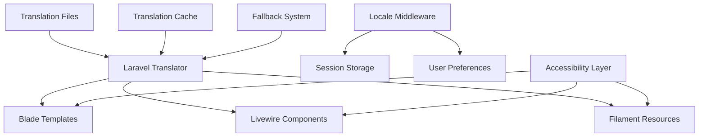

# Localization Architecture

## Overview

The localization architecture provides comprehensive multilingual support for the e-commerce platform, with Lithuanian as the default language and English as the secondary language. The system is built on Laravel's localization framework with custom enhancements for accessibility and user experience.

## System Architecture

### Core Components



### Data Flow

1. **Request Processing**
   - Locale detection from URL, session, or user preferences
   - Middleware sets application locale
   - Translation system loads appropriate language files

2. **Translation Resolution**
   - Key lookup in target locale
   - Fallback to default locale if key missing
   - Cache storage for performance optimization

3. **Rendering**
   - Templates receive translated strings
   - Components apply accessibility enhancements
   - UI renders with appropriate locale-specific formatting

## File Organization

### Directory Structure
```
resources/lang/
├── lt/                     # Lithuanian translations (default)
│   ├── categories.php      # Category management
│   ├── products.php        # Product management
│   ├── navigation.php      # Navigation elements
│   └── validation.php      # Validation messages
├── en/                     # English translations
│   ├── categories.php      # Category management
│   ├── products.php        # Product management
│   ├── navigation.php      # Navigation elements
│   └── validation.php      # Validation messages
├── lt.json                 # Simple key-value pairs (Lithuanian)
└── en.json                 # Simple key-value pairs (English)
```

### Translation File Architecture

#### Structured PHP Files
Used for complex, nested translations with logical grouping:

```php
<?php
// resources/lang/lt/categories.php

return [
    // Logical sections for maintainability
    'fields' => [...],      // Model attributes
    'actions' => [...],     // User interactions
    'messages' => [...],    // System feedback
    'validation' => [...],  // Error messages
    
    // Recent additions for UI accessibility
    'index_close' => 'Uždaryti',
    'show_adjust_filters' => 'Koreguokite filtrus, kad rastumėte tobulus produktus',
];
```

#### JSON Files
Used for simple key-value translations:

```json
{
    "welcome": "Sveiki atvykę",
    "loading": "Kraunama...",
    "error": "Klaida"
}
```

## Component Integration

### Blade Template Layer

#### Translation Helper Integration
```php
<!-- Basic translation -->
{{ __('categories.fields.name') }}

<!-- Accessibility-focused translation -->
<button aria-label="{{ __('categories.index_close') }}">
    <svg>...</svg>
</button>

<!-- Contextual help text -->
<p class="help-text">{{ __('categories.show_adjust_filters') }}</p>
```

#### Conditional Locale Rendering
```php
@if(app()->getLocale() === 'lt')
    <div class="lithuanian-specific-content">
        {{ __('categories.help.create_first_category') }}
    </div>
@endif
```

### Livewire Component Layer

#### Property-Based Translation
```php
<?php

namespace App\Livewire\Pages\Category;

use Livewire\Component;

class Show extends Component
{
    /**
     * Computed property for close button accessibility label.
     * 
     * @return string Localized close button label
     */
    public function getCloseButtonLabelProperty(): string
    {
        return __('categories.index_close');
    }
    
    /**
     * Computed property for filter guidance text.
     * 
     * @return string Localized filter help text
     */
    public function getFilterHelpTextProperty(): string
    {
        return __('categories.show_adjust_filters');
    }
}
```

#### Dynamic Translation Loading
```php
/**
 * Load translations based on component state.
 * 
 * @param string $context Current UI context
 * @return array Contextual translations
 */
public function getContextualTranslations(string $context): array
{
    return match($context) {
        'index' => [
            'title' => __('categories.index_title'),
            'close' => __('categories.index_close'),
        ],
        'show' => [
            'title' => __('categories.show_title'),
            'filters' => __('categories.show_adjust_filters'),
        ],
        default => [],
    };
}
```

### Filament Resource Layer

#### Form Field Localization
```php
<?php

namespace App\Filament\Resources;

use Filament\Forms\Components\TextInput;
use Filament\Resources\Resource;
use Filament\Schemas\Schema;

class CategoryResource extends Resource
{
    /**
     * Define form schema with localized labels and help text.
     * 
     * @param Schema $schema Form schema builder
     * @return Schema Configured form schema
     */
    public static function form(Schema $schema): Schema
    {
        return $schema->schema([
            TextInput::make('name')
                ->label(__('categories.fields.name'))
                ->helperText(__('categories.help.create_first_category'))
                ->required()
                ->maxLength(255),
        ]);
    }
}
```

## Accessibility Architecture

### ARIA Label Integration

#### Semantic Labeling
```php
/**
 * Generate accessibility-compliant button attributes.
 * 
 * @param string $action Button action type
 * @return array Button attributes with ARIA labels
 */
public function getButtonAttributes(string $action): array
{
    return [
        'aria-label' => __("categories.{$action}"),
        'title' => __("categories.{$action}"),
        'role' => 'button',
    ];
}
```

#### Screen Reader Support
```php
<!-- Screen reader announcements -->
<div aria-live="polite" aria-atomic="true">
    {{ __('categories.show_adjust_filters') }}
</div>

<!-- Descriptive labels for complex interactions -->
<button aria-describedby="filter-help">
    {{ __('categories.actions.filter') }}
</button>
<div id="filter-help" class="sr-only">
    {{ __('categories.help.filter_description') }}
</div>
```

## Performance Architecture

### Translation Caching

#### Cache Strategy
```php
<?php

namespace App\Services;

class TranslationCacheService
{
    /**
     * Cache translation data for performance optimization.
     * 
     * @param string $locale Target locale
     * @param string $namespace Translation namespace
     * @return array Cached translation data
     */
    public function getCachedTranslations(string $locale, string $namespace): array
    {
        return cache()->remember(
            "translations.{$locale}.{$namespace}",
            now()->addHours(24),
            fn() => trans($namespace, [], $locale)
        );
    }
    
    /**
     * Invalidate translation cache on updates.
     * 
     * @param string|null $locale Specific locale or all locales
     * @return void
     */
    public function invalidateCache(?string $locale = null): void
    {
        if ($locale) {
            cache()->forget("translations.{$locale}.*");
        } else {
            cache()->flush(); // Clear all translation cache
        }
    }
}
```

#### Lazy Loading
```php
/**
 * Load translations on demand to reduce memory usage.
 * 
 * @param string $key Translation key
 * @param string $locale Target locale
 * @return string|array Translation value
 */
public function lazyLoadTranslation(string $key, string $locale): string|array
{
    [$namespace, $subkey] = explode('.', $key, 2);
    
    if (!isset($this->loadedNamespaces[$locale][$namespace])) {
        $this->loadedNamespaces[$locale][$namespace] = trans($namespace, [], $locale);
    }
    
    return data_get($this->loadedNamespaces[$locale][$namespace], $subkey, $key);
}
```

### Memory Optimization

#### Selective Loading
```php
/**
 * Load only required translation sections.
 * 
 * @param array $sections Required translation sections
 * @param string $locale Target locale
 * @return array Filtered translations
 */
public function loadRequiredSections(array $sections, string $locale): array
{
    $translations = [];
    
    foreach ($sections as $section) {
        $translations[$section] = trans($section, [], $locale);
    }
    
    return $translations;
}
```

## Fallback System

### Locale Fallback Chain

```php
<?php

namespace App\Services;

class LocaleFallbackService
{
    /**
     * Define fallback chain for locale resolution.
     * 
     * @var array<string, array<string>>
     */
    protected array $fallbackChain = [
        'lt' => ['lt', 'en'],  // Lithuanian falls back to English
        'en' => ['en', 'lt'],  // English falls back to Lithuanian
    ];
    
    /**
     * Resolve translation with fallback support.
     * 
     * @param string $key Translation key
     * @param string $locale Primary locale
     * @return string Resolved translation
     */
    public function resolveWithFallback(string $key, string $locale): string
    {
        $fallbacks = $this->fallbackChain[$locale] ?? [$locale];
        
        foreach ($fallbacks as $fallbackLocale) {
            $translation = trans($key, [], $fallbackLocale);
            
            if ($translation !== $key) {
                return $translation;
            }
        }
        
        return $key; // Return key if no translation found
    }
}
```

## Testing Architecture

### Translation Testing Strategy

#### Completeness Testing
```php
<?php

namespace Tests\Feature\Localization;

use PHPUnit\Framework\TestCase;

class TranslationCompletenessTest extends TestCase
{
    /**
     * Test that all required translations exist in both locales.
     * 
     * @dataProvider translationKeyProvider
     */
    public function test_translation_completeness(string $key): void
    {
        $ltTranslation = __($key, [], 'lt');
        $enTranslation = __($key, [], 'en');
        
        $this->assertNotEquals($key, $ltTranslation, "Missing Lithuanian translation for: {$key}");
        $this->assertNotEquals($key, $enTranslation, "Missing English translation for: {$key}");
    }
    
    /**
     * Provide translation keys for testing.
     * 
     * @return array<array<string>>
     */
    public function translationKeyProvider(): array
    {
        return [
            ['categories.index_close'],
            ['categories.show_adjust_filters'],
            ['categories.fields.name'],
            // ... more keys
        ];
    }
}
```

#### Accessibility Testing
```php
/**
 * Test that accessibility-related translations are appropriate.
 */
public function test_accessibility_translations(): void
{
    $closeLabel = __('categories.index_close', [], 'en');
    
    // Should be short and descriptive
    $this->assertLessThan(20, strlen($closeLabel));
    $this->assertNotEmpty($closeLabel);
    
    // Should not contain technical jargon
    $this->assertStringNotContainsString('btn', strtolower($closeLabel));
    $this->assertStringNotContainsString('click', strtolower($closeLabel));
}
```

## Security Considerations

### Translation Injection Prevention

```php
/**
 * Sanitize translation parameters to prevent injection attacks.
 * 
 * @param array $parameters Translation parameters
 * @return array Sanitized parameters
 */
public function sanitizeTranslationParameters(array $parameters): array
{
    return array_map(function ($value) {
        if (is_string($value)) {
            return htmlspecialchars($value, ENT_QUOTES, 'UTF-8');
        }
        return $value;
    }, $parameters);
}
```

### Content Security Policy

```php
/**
 * Ensure translations comply with CSP requirements.
 * 
 * @param string $translation Translation string
 * @return string CSP-compliant translation
 */
public function ensureCSPCompliance(string $translation): string
{
    // Remove potentially dangerous content
    $translation = preg_replace('/<script\b[^<]*(?:(?!<\/script>)<[^<]*)*<\/script>/mi', '', $translation);
    $translation = preg_replace('/javascript:/i', '', $translation);
    
    return $translation;
}
```

## Deployment Considerations

### Translation Compilation

```bash
# Compile translations for production
php artisan config:cache
php artisan route:cache
php artisan view:cache

# Clear translation cache on deployment
php artisan config:clear
```

### Environment Configuration

```php
// config/app.php
'locale' => env('APP_LOCALE', 'lt'),
'fallback_locale' => env('APP_FALLBACK_LOCALE', 'en'),
'supported_locales' => ['lt', 'en'],
```

## Future Enhancements

### Planned Improvements

1. **Dynamic Translation Loading**
   - API-based translation management
   - Real-time translation updates
   - Translation versioning system

2. **Advanced Accessibility**
   - Voice navigation support
   - High contrast mode translations
   - Dyslexia-friendly text options

3. **Performance Optimizations**
   - Translation preloading strategies
   - CDN-based translation delivery
   - Micro-frontend translation isolation

## Related Documentation

- [Translation File Documentation](../localization/categories-translations.md)
- [API Documentation](../api/localization-api.md)
- [Component Documentation](../components/category-ui.md)
- [Localization Guidelines](../../.kiro/steering/localization-guidelines.md)